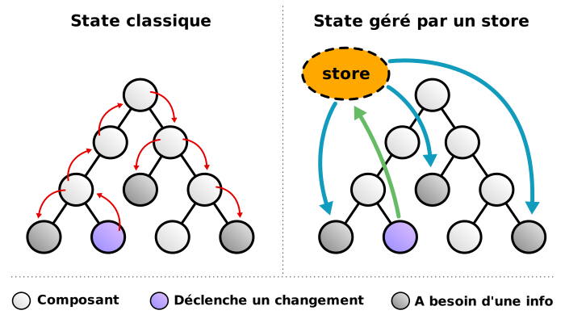

# Récap React

Un petit retour sur React

---

## React rocks!

La programmation déclarative, c'est magique !
		
On décrit notre interface comme elle doit être à chaque instant,
plutôt que décrire comment la modifier d'état en état.
<!-- .element: class="fragment" -->

- L'interface obtenue est prédictible.
<!-- .element: class="fragment" -->
- Un code facile à débuguer.
<!-- .element: class="fragment" -->


### Comment ça marche ?

```js
import { createRoot } from 'react-dom/client';

import App from 'src/components/App';

const rootReactElement = <App />;
const root = createRoot(document.getElementById('root'));
root.render(rootReactElement);
```

---

## Composants
<!-- .slide: data-background="#e98c36" -->


### Stateless component

```js
const Post = ({ title, content }) => (
 <div className="post">
   <h1 className="post-title">{title}</h1>
   <div className="post-content">{content}</div>
 </div>
);

export default Post;

```


### Uncontrolled component

```js
const Field = ({ value }) => {
  return (
    <input type="text" defaultValue={value} />
  );
};
```

---

## State
<!-- .slide: data-background="#e98c36" -->


### State ?

- définir des données dans le composant
- si ces données changent, React refait le rendu du composant

> refait le JSX du composant et des composants imbriqués

```js
const [message, setMessage] = useState('Bonjour');
//        1          2                     3

// 1. La donnée
// 2. Le moyen de modifier la donnée
// 3. La valeur de départ de la donnée
```


### Mise en place

On récupère `useState` depuis `react`

```js
import { useState } from 'react';
```
<!-- .element: class="fragment" -->


### State component

```js
import { useState } from 'react';

const App = () => {
  const [count, setCount] = useState(0);

  const increment = () => { setCount(count + 1) };

  return (
    <div className="app">
      <div className="count">{count}</div>
      <button onClick={increment}>Incrémenter</button>
    </div>
  );
};
```


### Controlled component

```js
const Field = () => {
  const [value, setValue] = useState('');

  const handleChange = (evt) => { 
    setValue(evt.target.value);
  };

  return (
    <input
      type="text"
      value={value}
      onChange={handleChange}
    />
  );
};
```

---

## Effets
<!-- .slide: data-background="#e98c36" -->


### Ça veut dire quoi ?

Exécuter un bout de code (une fonction) à certains moments dans la vie de nos composants.

<!-- .element: class="fragment" -->

- **à leur création** : _mount_
  - chargement de données initiales (ajax)
  - poser des écouteurs d'événements 
  - manipulation du DOM 
- **à leur mise à jour** : _update_
  - manipulation du DOM, timers
  - impacter des sous composants
- **à leur destruction** : _unmount_
  - supprimer des timers (clearTimeout)
  - supprimer des écouteurs (removeEventListeners)

<!-- .element: class="fragment" -->


### Mise en place

On récupère `useEffect` depuis `react`

```js
import { useEffect } from 'react';
```
<!-- .element: class="fragment" -->


### Différents cas

```js
// au chargement initial et lors d'évolutions
useEffect(() => {
  console.log('Tout le temps, à chaque rendu');
});

// uniquement au chargement initial
useEffect(() => {
  console.log('Juste au rendu initial');
}, []);

// uniquement si la variable `info` change
useEffect(() => {
  console.log('Au rendu initial et si `info` change');
}, [info]); 
```

Le 2ème argument `[..]` est appelé le tableau de dépendances de l'effet.

Si les valeurs de ce tableau changent, l'effet est relancé.


### Le cas `unmount` (destruction)

- le callback de l'effet peut renvoyer une fonction
- cette fonction sera exécutée chaque fois que l'effet est exécuté (avant l'application de l'effet), et juste avant que le composant disparaisse de l'interface
 
```js
useEffect(() => {
  console.log('Au rendu initial et si `info` change');
  
  return () => {
    console.log('Nettoyage : Juste avant que `info` change et lors de la destruction du composant');
  }
}, [info]); 
```

---

## En conclusion
<!-- .slide: data-background="#e98c36" -->


### Quelques habitudes avec les composants

- On passe les propriétés de composant en composant, données comme fonctions
<!-- .element: class="fragment" -->
- Les données viennent d'en haut et se dispatchent dans les sous composants
<!-- .element: class="fragment" -->
- On peut développer et tester chaque composant un par un
<!-- .element: class="fragment" -->
- Une fois qu'on a développé un composant, on peut l'oublier !
<!-- .element: class="fragment" -->
- = Pas de surprise, pas d'effet de bords
<!-- .element: class="fragment" -->


### Quelques habitudes avec le state et les effets

- On stocke l'état de l'application dans le state
<!-- .element: class="fragment" -->
- Dès que le state change, le composant qui le contient est re-rendu
<!-- .element: class="fragment" -->
  - Tous ses enfants avec lui
<!-- .element: class="fragment" -->
- Les effets permettent de gérer les traitements annexes (effet de bords)
<!-- .element: class="fragment" -->
  - Ils peuvent être déclenchés à différents instants de la vie du composant
<!-- .element: class="fragment" -->


### Où en sommes-nous ? 1/2

On sait faire :

  - Ajouter le composant racine au DOM
  - Créer des composants pour découper notre application
  - Irriguer nos composants de données
  - Tester les données reçues par nos composants avec PropTypes
  - Modifier les données et mettre à jour l'UI
  - Effets de bords : Ajax, DOM, etc.
  - Faire des vues différentes selon l'URL


### Où en sommes-nous ? 2/2

On ne sait pas (encore) faire :

- Irriguer nos composants de données _sans intermédiaire_
- S'organiser avec une application qui grossit
- _Séparer_ les données et effets de bords des components
- Tester _systématiquement_ nos données, nos fonctions


---

# Redécouvrons le state

---

 
<!-- .element height="100%" width="100%" -->
