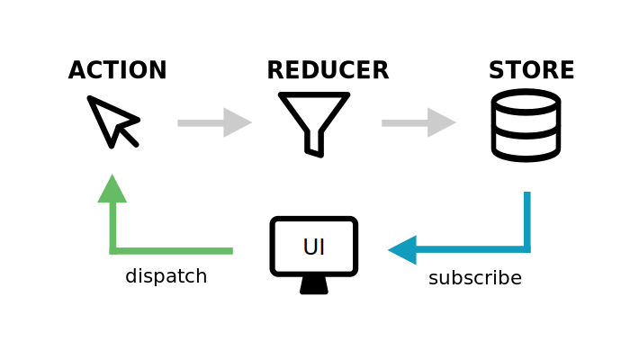

# Récap Redux

Petit point sur Redux

---

## Store

<!-- .slide: data-background="#e98c36" -->


### Avec ou sans store


&nbsp;


### Gestionnaire de state

Redux est un store : un gestionnaire de state

- Isolation du state à "l'extérieur" de l'application
- Agnostique : fonctionne avec n'importe quelle lib, même en Vanilla.
- Propose une API simple
  - `getState` : lecture du state
  - `dispatch` : modification du state
  - `subscribe` : abonnement aux changements


### Grands principes

- Propose de déclencher des `actions` représentant une intention, la volonté de modification
- Les `actions` passent par un `reducer` qui retourne un nouveau state
- On peut s'abonner aux changements du state via `subscribe`




### Comment ça marche ?

```js
import { createStore } from 'redux';

// ...

const store = createStore(reducer);
```

---

## Reducer

<!-- .slide: data-background="#e98c36" -->


### Un entonnoir

- Une fonction recevant le `state` actuel et une `action`.
- La plupart du temps, un `switch` permet de traiter l'`action`.
- Retourne un nouveau state : 
  - les données de l'ancien state 
  - les nouveautés


### Anatomie

```js
const reducer = (state = initial, action = {}) => {
  switch (action.type) {
    case SWITCH_ON:
      return {
        ...state,
        active: true,
      };

    default:
      return state;
  }
}
```

---

## Actions

<!-- .slide: data-background="#e98c36" -->


### Qu'est ce que c'est ?

- Au départ, une simple chaîne de caractères indiquant une volonté
  - CHANGE_LA_VALEUR
  - GENERE_UNE_NOUVELLE_COULEUR
  - INVERSE_LA_VISIBILITÉ
- Par souci de maniabilité, les actions sont exprimées sous forme d'objet
  - transporte le type de l'action (son nom)
  - si besoin, transporte aussi le _payload_ de l'action (des données, le _chargement_)

```js
{ type: 'CHANGE_LA_VALEUR', valeur: 'monemail@site.com' }
```
<!-- .element: class="fragment" -->


### Types

- Par convention et praticité, les types d'actions sont écrits
  - en majuscules
  - en anglais
  - dans des variables du même nom
  - dans un fichier indépendant

```js
export const CHANGE_VALUE = 'CHANGE_VALUE';
export const GENERATE_NEW_COLOR = 'GENERATE_NEW_COLOR';
export const TOGGLE_VISIBILITY = 'TOGGLE_VISIBILITY';
```
<!-- .element: class="fragment" -->


### Creators

Pour faciliter leur usage à travers l'application, les actions sont accompagnées d'un `action creator`.

- Un action creator est une fonction qui génère une `action` avec
  - le type
  - si besoin, le contenu (souvent appelé _payload_)

```js
export const CHANGE_VALUE = 'CHANGE_VALUE';

export const changeValue = (content) => ({
  type: CHANGE_VALUE,
  value: content,
});

// exemple d'usage :
changeValue('Le soleil brille');
// => { type: CHANGE_VALUE, value: 'Le soleil brille' }
```
<!-- .element: class="fragment" -->

---

## Middleware

<!-- .slide: data-background="#e98c36" -->


### Qu'est ce que c'est ?

- Permet de gérer les effets de bords comme les requêtes ajax.
- Le middleware recoit les actions avant le reducer.
- Le middleware a accès au store et à l'action.
- On y gère les actions comme dans le reducer.
- Attention, un middleware peut empêcher l'action d'aller au reducer.


### Anatomie

```js
const demoMiddleware = (store) => (next) => (action) => {
  // On intercepte les actions
  switch (action.type) {
    // ...
  }

  // On passe à son voisin :)
  next(action);
};

export default demoMiddleware;
```

---

## Redux avec React

<!-- .slide: data-background="#e98c36" -->


### React + Redux = ♡

Il est possible de travailler directement avec `redux` depuis `react`, via `subscribe` pour regénérer les composants.

> Mais c'est compliqué, long et répétitif.
<!-- .element: class="fragment" -->

La bibliothèque `react-redux` propose des raccourcis, des branchements entre `react` et `redux`.
<!-- .element: class="fragment" -->

> C'est ce qu'on utilise !
<!-- .element: class="fragment" -->


### Provider

Mettre le store à disposition

```js
import React from 'react';
import { createRoot } from 'react-dom/client';
import { Provider } from 'react-redux';

import App from 'src/components/App';
import store from 'src/store';

const rootReactElement = (
  <Provider store={store}>
    <App />
  </Provider>
);
const root = createRoot(document.getElementById('root'));
root.render(rootReactElement);
```
<!-- .element: class="fragment" -->


### Hooks

`useSelector` et `useDispatch`

```js
import React from 'react';
import { useSelector, useDispatch } from 'react-redux';
import { hide } from 'src/actions/colors';

const Message = () => {
  const dispatch = useDispatch();
  const content = useSelector((state) => state.content);

  return (
    <div className="message">
      <a onClick={() => dispatch(hide())}>Hide message</a>
      {content}
    </div>
  );
};
```
<!-- .element: class="fragment" -->


---

## Extras

<!-- .slide: data-background="#e98c36" -->


### Plusieurs reducers ?

Il est possible de définir plusieurs reducers pour une même application.

`redux` propose un utilitaire pour découper le state avec plusieurs reducers via `combineReducers`.


### Plusieurs reducers : reducer principal

`src/reducers/index.js`

```js
import { combineReducers } from 'redux';

import userReducer from './user';
import todosReducer from './todos';
import settingsReducer from './settings';

export const combineReducers({
  // nom du tiroir: reducer qui s'en occupe
  todos: todosReducer,
  user: userReducer,
  settings: settingsReducer,
});
```


<!-- .element: class="fragment" -->


### Plusieurs reducers : state complet

```js
{
  user: {
    username: 'Will', 
    // ...
  },
  todos: [
    {
      name: 'Liste de courses',
      list: [
        { id: 12, label: 'Fromage', done: false },
      ],
    },
    // ...
  ],
  settings: {
    theme: 'dark',
  },
}
```


=> découpage en tiroirs, un reducer par tiroir


### Plusieurs reducers : reducer user

`src/reducers/user.js`

```js
const initialState = {
  username: 'Will',
  firstname: 'William',
  lastname: 'Smith',
  role: 'admin',
};
```

Accessible par : `state.user`


### Plusieurs reducers : reducer todos

`src/reducers/todos.js`

```js
const initialState = [
  {
    name: 'Liste de courses',
    list: [
      { id: 12, label: 'Fromage', done: false },
    ],
  },
  {
    name: 'Boulot',
    list: [
      { id: 19, label: 'Préparer cours', done: true },
      { id: 21, label: 'Fix issue GitHub', done: false },
    ],
  },
];
```

Accessible par : `state.todos`


### Plusieurs reducers : reducer settings

`src/reducers/settings.js`

```js
const initialState = {
  theme: 'dark',
};
```

Accessible par : `state.settings`


---

# Allons coder !
