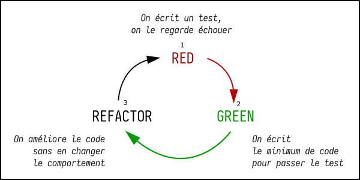

# Tests

Découvrons les principes associés aux tests.

---

## Écrire du code c'est...
<!-- .slide: data-background="#e98c36" -->

### Refactoriser

Quand on écrit du code, on cherche tout le temps à

- l'améliorer
- le rendre plus efficace
- le rendre plus "élégant"

### Affronter des régressions

Mais, quand on écrit du code, on le fait parfois régresser

- une fonctionnalité se comporte autrement
- un bout de code renvoie une nouvelle erreur
- une amélioration casse l'application

### Changer de lib / de structure

Il arrive fréquemment de changer d'outil, de bibliothèque ou de faire évoluer du code "legacy" 

- Changer une lib par une nouvelle
  - plus rapide
  - plus puissante
  - plus élégante
  - ...plus hype ?? ...on n'a pas toujours le choix
- Toucher à un code legacy
  - non maintenu
  - non testé
  - non commenté
  - ...personne ne veut y aller :o

### Constat

Quand on écrit du code, il y a toujours des bugs

- même si on est super fort,
- qu'on a fait très attention,
- qu'on est dans une équipe de "brutes",
- qu'on peut lire la matrice sans décodeur...

> TOUJOURS
<!-- .element: class="fragment" -->

---

## Test
<!-- .slide: data-background="#e98c36" -->

### Kézako ? 

Les tests... vous connaissez déjà.
<!-- .element: class="fragment" -->

Si je vous dis "parcours"...
<!-- .element: class="fragment" -->

Un test, c'est du code qui exécute du code afin de vérifier si le résultat obtenu est bien celui attendu (valeur de retour, types attendus, ...)
<!-- .element: class="fragment small" -->

Par exemple : "vérifier si `sum(3, 5)` retourne bien `8`". On cherche à vérifier si cette assertion est bel et bien vraie.
<!-- .element: class="fragment small" -->

### À quoi ça sert

- vérifier que le code fonctionne comme attendu et pour tous les cas
- découvrir les bugs le plus tôt possible
- stabiliser le code, empêcher les régressions, faire évoluer et améliorer le code
- pouvoir réécrire le code en changeant de bibliothèque, d'organisation des fichiers
- améliorer le code petit à petit
  - on voit un bug, 
  - on écrit un test qui reproduit le bug,
  - on corrige le bug,
  - on rajoute un test pour s'assurer que ce bug ne reviendra plus ;)

### Types de tests

Selon la classification officielle du [Comité français du test logiciel](http://www.cftl.fr/), il existe 4 niveaux de test :

- Test unitaire 
  - on teste une unité de code, une partie précise du code (une fonction, un composant)
- Test d'intégration
  - on teste l'assemblage de plusieurs parties de code, par exemple back-end + front-end 
- Test système ou test fonctionnel
  - on teste la conformité du système
  - Exemples : test UI / IHM, test de performance / benchmark, test de charge, ...
- Test d'acceptation
  - on teste le projet avec le client pour s'assurer que tout soit conforme aux attentes / exigences

### euh... ça fait beaucoup quand même

Oui ça fait beaucoup de tests possibles
<!-- .element: class="fragment" -->

Dans une entreprise, il peut y avoir des personnes dédiées à chaque niveau de test (développeur ou non).
<!-- .element: class="fragment small" -->

> Nous allons nous concentrer sur les tests unitaires
<!-- .element: class="fragment" -->

---

## Test unitaire
<!-- .slide: data-background="#e98c36" -->

### Tester une unité

- une fonction
- un composant
- un fragment du programme

Le principe est de tester pendant que l'on code ou dès que le fragment de code est fonctionnel. L'idée étant de limiter les régressions.
<!-- .element: class="fragment" -->

Ces tests sont rapides à exécuter et suffisament nombreux pour prévoir les différents cas de figures.
<!-- .element: class="fragment" -->

### Outils

Pour exécuter les tests, on utilise certains outils pour cadrer le travail et avoir une uniformité.

> un `if` ça suffit pas ?
<!-- .element: class="fragment" -->

En soi, c'est suffisant mais difficile de décrire ce que le test va vraiment vérifier.
<!-- .element: class="fragment small" -->

On va utiliser un `test runner`, organiser nos tests et y faire des `assertion`s
<!-- .element: class="fragment small" -->

---

## Quand écrire les tests d'une application ?
<!-- .slide: data-background="#e98c36" -->

### Les tests durant le développement

- simplifie le travail du développeur 
  - limite les régressions et donc le besoin de debugguer le code
- fait gagner du temps par la suite 
  - il faut trois jours pour trouver la ligne de code qui pose problème
- Plus on écrit les tests tôt au cours du développement et mieux c'est : 
   - un bon compromis est d'écrire les tests d'une fonction ou d'un composant juste après l'avoir écrit 

> avoir des tests seulement pour les fonctions cruciales, c'est mieux que pas de tests du tout

### Les tests à la fin du dev ?

Si on écrit les tests seulement après avoir fini de coder l'application, on risque :

- d'avoir du mal à tester certaines parties (mauvais découpage du code, fonction qui fait trop de choses), et ça prendrait du temps de corriger
- de tomber sur des bugs énormes qui nous obligent à changer l'architecture de l'application => il va falloir réécrire beaucoup plus de code que si on avait vu le problème plus tôt

---

# Allons essayer

---

## TDD
<!-- .slide: data-background="#e98c36" -->

### TDD, ça veut dire quoi

Test Driven Development / Développement piloté par les tests
<!-- .element: class="fragment" -->

Concrètement, les tests sont écrits **avant** le code, et le code devra s'y conformer
<!-- .element: class="fragment" -->

Un cycle assez étrange à première vue mais...
<!-- .element: class="fragment" -->

### Avantages

- à un instant donné, on sait que tout le code fonctionne
- il n'y a pas de code non testé dans l'application finie
- Efficacité : on écrit seulement le code dont on a besoin pour la fonctionnalité en cours
- Point de départ : on définit les contours à l'avance en écrivant le test 
- Maintenance facilitée : pas de code inutile dans l'application

### Cycle TDD

### 3 lois

- 1 : Vous devez écrire un test qui échoue avant de pouvoir écrire le code de production correspondant.
   - on n'écrit pas de code sans avoir écrit un test avant, ce test permettra de vérifier que le code fonctionne
- 2 : Vous devez écrire une seule assertion à la fois, qui fait échouer le test ou qui échoue à la compilation (ou erreur de syntaxe en Javascript).
   - on écrit les tests un par un, on n'écrit pas d'un coup tous les tests nécessaires
- 3 : Vous devez écrire le minimum de code de production pour que l'assertion du test actuellement en échec soit satisfaite.
  - on se concentre sur "faire passer le test qu'on vient d'écrire", on ne code pas autre chose ailleurs

### Le TDD en pratique

Le véritable TDD est rare 
- impression de perte de temps car énormément de tests à écrire,
- spécifications pas toujours suffisamment claires,
- processus de développement qui peut paraître pénible.

